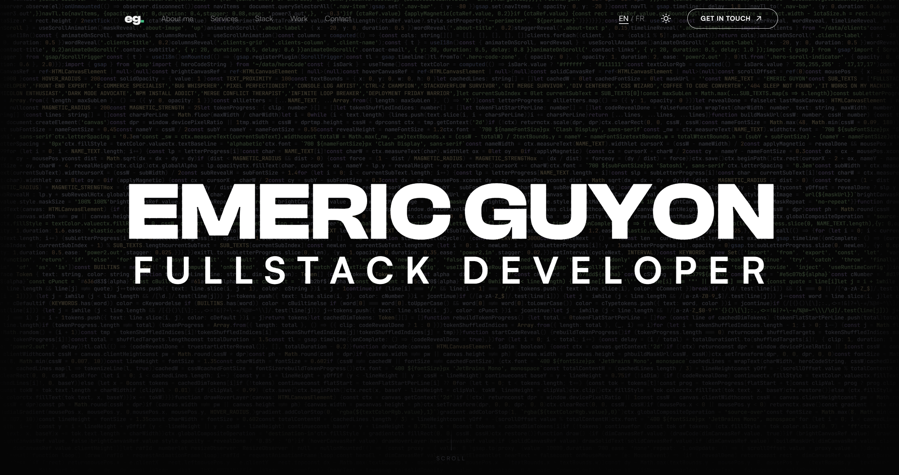

<div align="center">

# emericguyon.com

**Freelance Fullstack Developer Portfolio**

Dark theme | Bilingual FR/EN | GSAP Animations

[](https://emericguyon.com)



</div>

---

## Tech Stack

<div align="center">


</div>

## Features

- **Canvas Hero** — custom code rain effect with spotlight reveal on hover
- **Scroll Animations** — word reveal, letter reveal, fade-in via GSAP ScrollTrigger
- **Dark / Light Theme** — toggle with smooth transitions, persisted via cookie
- **Bilingual** — French (default) + English with `/en/` prefix
- **Responsive** — optimized for mobile, tablet and desktop
- **Performance** — lazy-loaded sections, FPS-capped canvas, reduced-motion support

## Getting Started

```bash
npm install
npm run dev
```

Dev server runs on `http://localhost:3000`.

## Build

```bash
npm run build     # SSR build
npm run generate  # Static generation
```

## Project Structure

```
app/
  components/
    home/        # Hero, About, Services, Skills, Projects, Clients
    project/     # ProjectDetail
    icons/       # SVG icon components
    ui/          # Badge, ThemeToggle
    App*.vue     # AppNavigation, AppFooter, AppContact, AppPageTransition
  composables/   # useScrollAnimation, useTheme, useSeo, useCustomCursor
  pages/         # index, projets/[slug]
  data/          # Projects, skills, clients, hero code
i18n/locales/    # fr.json, en.json
public/          # Images, fonts, favicon
```

## License

[MIT](LICENSE)
